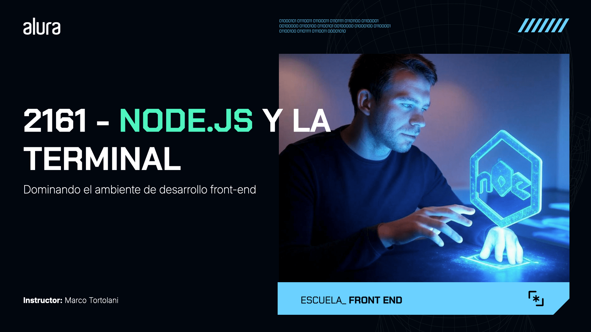
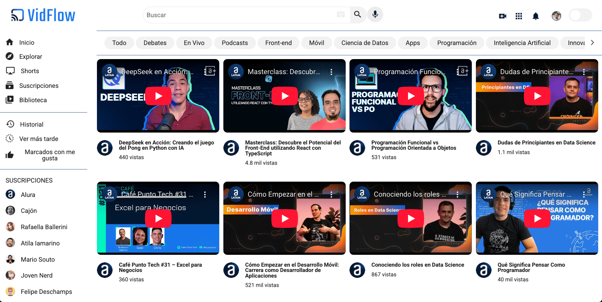

# VidFlow



VidFlow es una plataforma de compartición de videos.



## 🔨 Funcionalidades del proyecto

Actualmente, la interfaz del proyecto y su funcionalidad para buscar información de videos en una API ya están listas.

Ahora, el equipo de desarrollo de VidFlow ha decidido implementar nuevas herramientas para mejorar la calidad del código del proyecto, como ESLint, Prettier, Axios y Vite.

Para ello, aprenderemos a utilizar **Node.js**, necesario para aplicar todas estas herramientas.

## ✔️ Técnicas y tecnologías utilizadas

- Node.js
- NPM
- Los paquetes ESLint, Prettier, JSON Server, Axios y Vite
- Vercel

## Enlace de Figma

[Accede al Figma de VidFlow](https://www.figma.com/file/a0crwitCtGmNIQW0RVIs5H/VidFlow-%7C-Curso-Js---Consumindo-dados-de-uma-API?node-id=0%3A1&mode=dev).

## 🛠️ Cómo abrir y ejecutar el proyecto

Después de descargar o clonar el proyecto desde este repositorio, necesitas tener instalado [Node.js](https://nodejs.org/) y [`json-server`](https://www.npmjs.com/package/json-server).

Si no tienes `json-server` instalado globalmente, ejecuta el siguiente comando:

```bash
npm install -g json-server@0.17.4
```

Con Node.js y `json-server` instalados, ejecuta el siguiente comando para habilitar la API local de videos:

```bash
json-server --watch backend/videos.json
```

Luego, abre `index.html` en el navegador y ¡VidFlow estará listo para usarse!

## 📚 Más información sobre el curso

Este repositorio avanza hasta la implementación de ESLint y Prettier, pero aún no incluye el uso de Vite con Axios. Para utilizar Vite, fue necesario migrar el código a un nuevo proyecto, que puedes encontrar en [este repositorio](https://github.com/alura-cursos/3519-nodejs-vidflow-vite).
